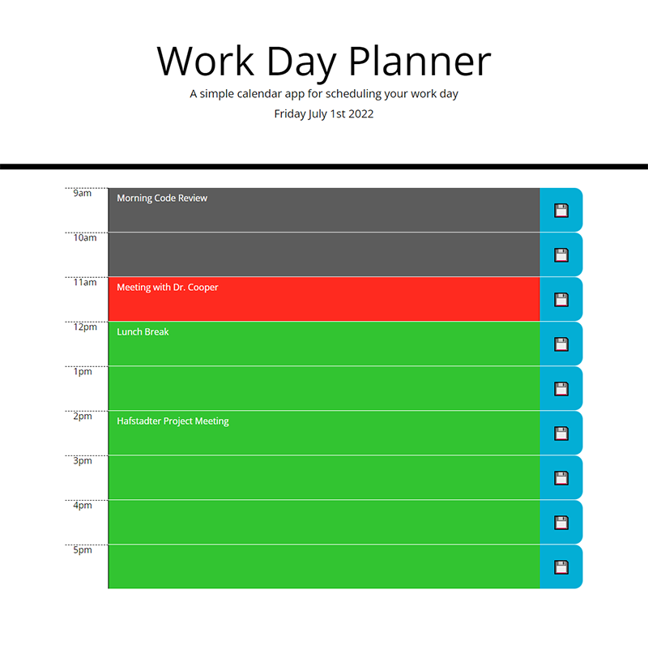

# Work Day Planner - 
## Deployed Application
[Deployed Application](https://danielstewart914.github.io/work-day-planner/)
## Description

### A simple calendar app for scheduling your work day. 
All hours Blocks are color coded with the following colors: 
- Grey: Past Hour(s)
- Red: Current Hour
- Grean: Future Hour(s)
 
## Table of Contents

- [Usage](#usage)
- [License](#license)
- [Technology](#technology)
- [Questions](#questions)

## Usage

To add an event ot your calendar do the following steps:

- Click into any Hour Block to enter a text description for your scheduled event.
- Click the Save Icon at the end of the Hour Block to save the Event.
( Be sure to hit the Save icon after removing events as well. )

### Preview image

## License

MIT License

Copyright 2022 &copy; Daniel Stewart

Permission is hereby granted, free of charge, to any person obtaining a copy of this software and associated documentation files (the "Software"), to deal in the Software without restriction, including without limitation the rights to use, copy, modify, merge, publish, distribute, sublicense, and/or sell copies of the Software, and to permit persons to whom the Software is furnished to do so, subject to the following conditions:

The above copyright notice and this permission notice shall be included in all copies or substantial portions of the Software.

THE SOFTWARE IS PROVIDED "AS IS", WITHOUT WARRANTY OF ANY KIND, EXPRESS OR IMPLIED, INCLUDING BUT NOT LIMITED TO THE WARRANTIES OF MERCHANTABILITY, FITNESS FOR A PARTICULAR PURPOSE AND NONINFRINGEMENT. IN NO EVENT SHALL THE AUTHORS OR COPYRIGHT HOLDERS BE LIABLE FOR ANY CLAIM, DAMAGES OR OTHER LIABILITY, WHETHER IN AN ACTION OF CONTRACT, TORT OR OTHERWISE, ARISING FROM, OUT OF OR IN CONNECTION WITH THE SOFTWARE OR THE USE OR OTHER DEALINGS IN THE SOFTWARE.

## Technology

- 
- 
- 
- [![moment.js](https://img.shields.io/badge/moment.js-323330.svg?style=for-the-badge&logo=data:image/svg+xml;base64,PHN2ZyBoZWlnaHQ9IjI1NiIgcHJlc2VydmVBc3BlY3RSYXRpbz0ieE1pZFlNaWQiIHZpZXdCb3g9IjAgMCAyNTYgMjU2IiB3aWR0aD0iMjU2IiB4bWxucz0iaHR0cDovL3d3dy53My5vcmcvMjAwMC9zdmciPjxnIGZpbGwtcnVsZT0iZXZlbm9kZCI+PHBhdGggZD0ibTEyOCAyNTZjNzAuNjkyNDQ4IDAgMTI4LTU3LjMwNzU1MiAxMjgtMTI4cy01Ny4zMDc1NTItMTI4LTEyOC0xMjgtMTI4IDU3LjMwNzU1Mi0xMjggMTI4IDU3LjMwNzU1MiAxMjggMTI4IDEyOHptMC0xOS4yYy02MC4wODg1ODA4IDAtMTA4LjgtNDguNzExNDE5LTEwOC44LTEwOC44IDAtNjAuMDg4NTgwOCA0OC43MTE0MTkyLTEwOC44IDEwOC44LTEwOC44IDYwLjA4ODU4MSAwIDEwOC44IDQ4LjcxMTQxOTIgMTA4LjggMTA4LjggMCA2MC4wODg1ODEtNDguNzExNDE5IDEwOC44LTEwOC44IDEwOC44eiIgZmlsbD0iIzM3NjY2MCIvPjxwYXRoIGQ9Im0xMjggMjMwLjRjNTYuNTUzOTU4IDAgMTAyLjQtNDUuODQ2MDQyIDEwMi40LTEwMi40IDAtNTYuNTUzOTU4NC00NS44NDYwNDItMTAyLjQtMTAyLjQtMTAyLjQtNTYuNTUzOTU4NCAwLTEwMi40IDQ1Ljg0NjA0MTYtMTAyLjQgMTAyLjQgMCA1Ni41NTM5NTggNDUuODQ2MDQxNiAxMDIuNCAxMDIuNCAxMDIuNHptMC0xOTguNGMtMy41MzQ2MjIgMC02LjQgMi44Nzk2NzIxLTYuNCA2LjQ0MzgxMXY4My4xNTYxODloLTQ0LjgxOTAwNzRjLTMuNTI0MTI0OCAwLTYuMzgwOTkyNiAyLjg0MDczNS02LjM4MDk5MjYgNi40IDAgMy41MzQ2MjIgMi45MTYyNTIyIDYuNCA2LjM3MDU0NDYgNi40aDU3LjYyOTQ1NTR2LTk1Ljk5NDQyMTRjMC0zLjUzNzcwMzQtMi44NDA3MzUtNi40MDU1Nzg2LTYuNC02LjQwNTU3ODZ6IiBmaWxsPSIjNTI5OTkwIi8+PC9nPjwvc3ZnPg==)](https://momentjs.com/)
- 
- 

## Questions 

Contact me through on of the links below  
[GitHub](https://github.com/danielstewart914) 
[Email](mailto:danielstewart914@outlook.com)
